## Jobsheet: Subject Mobile Programming Week 2

| **Information** | **Detail** |
| --- | --- |
| Subject | Mobile Development |
| Name | Andhika Daffa Athaaillah |
| Absen | 02 |
| NIM | 244107020223 |

## Lab: simple layout (warm-up)

## Warm-up experiments
### 1. Remove Expanded from the name row, observe the overflow warning or layout behavior, then restore it.

### 2. Replace mainAxisSize: MainAxisSize.min with the default value and observe the card height change.
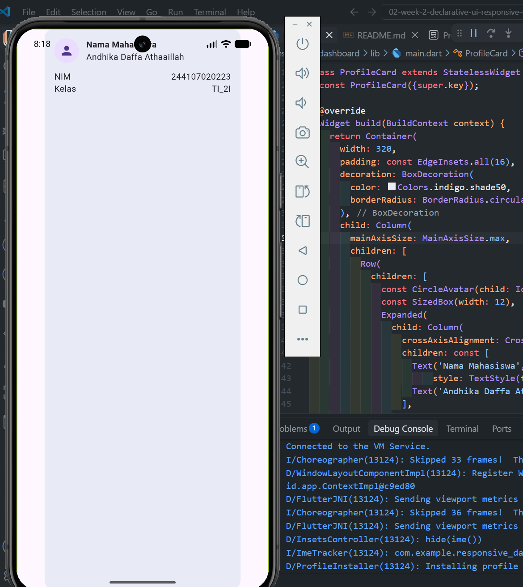
### 3. Add one more data row (e.g. Email) using the same Row + Expanded pattern.

## Practicum

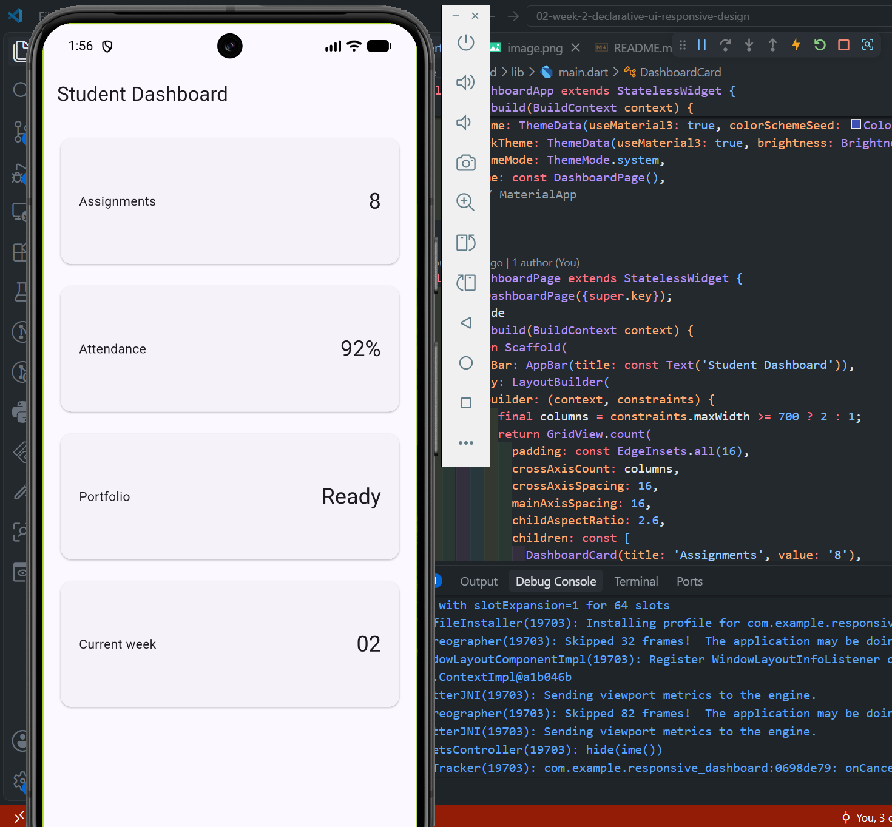

### Adding interaction: StatefulWidget and Cupertino

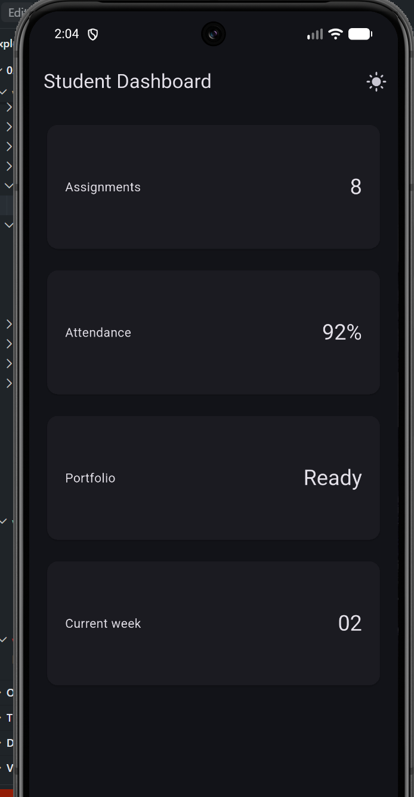

### Adjust DashboardPage to receive the state and callback:

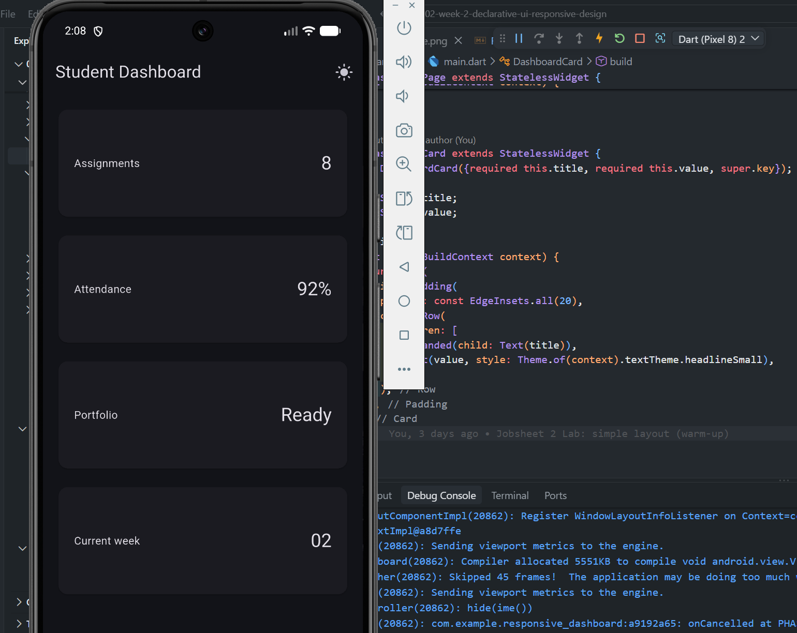

## Layout experiments
### Change the 700 breakpoint and observe the column count.

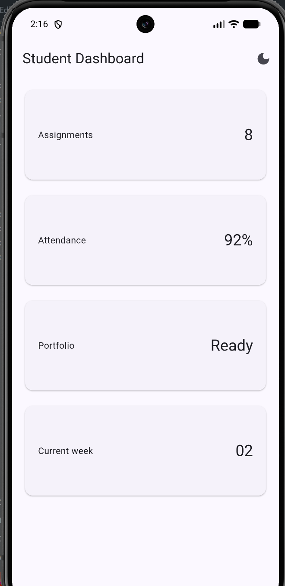

How the column count changes based on screen width:
    - < 600px: Uses 1 column (stacking cards vertically).
    - 600px - 899px: Uses 2 columns side-by-side.
    - ≥ 900px: Expands to 3 columns across the grid.

### Change themeMode to ThemeMode.dark, then restore ThemeMode.system.

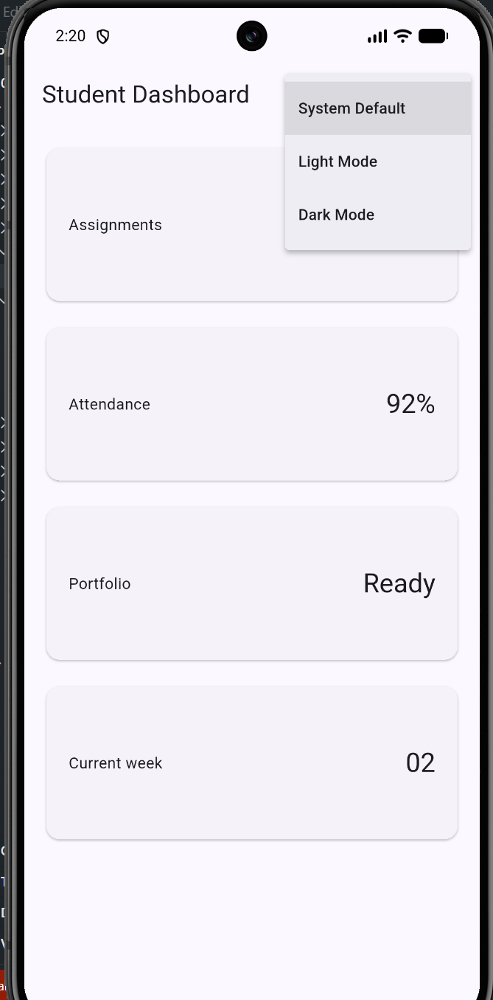

### Test the application at different emulator screen sizes.

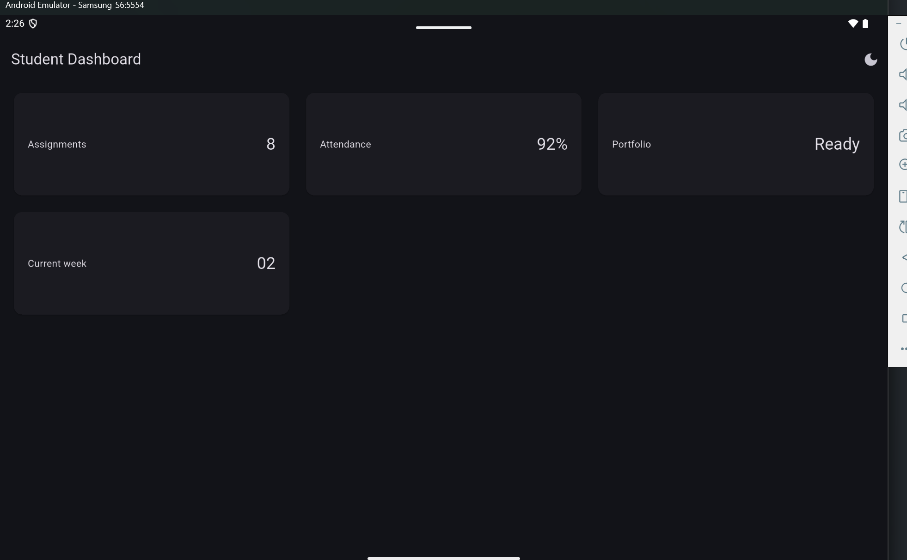

### Add Semantics or meaningful labels to important screen-reader elements.

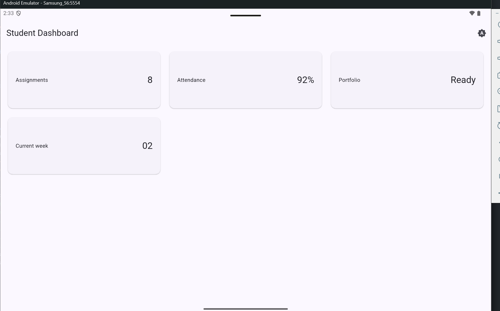

## 6. Assignment and AI design exploration
### Main assignment

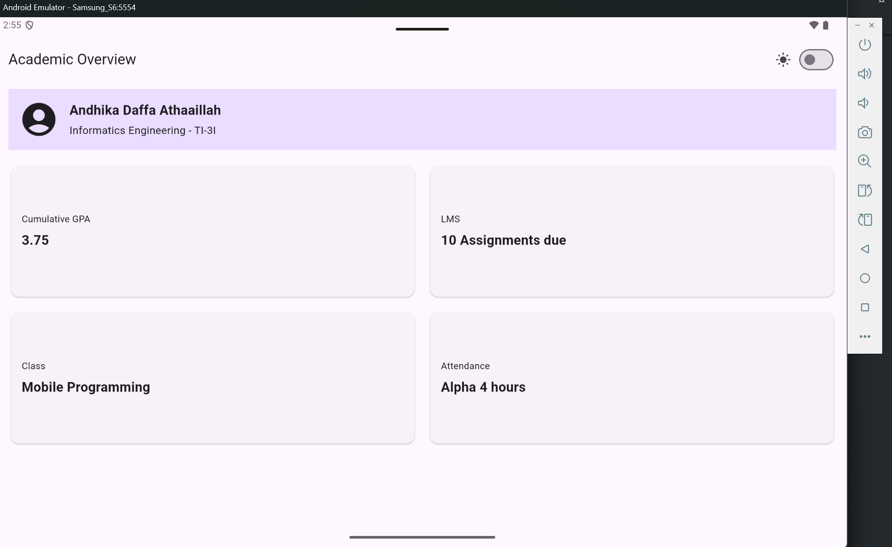

### AI Prompt Challenge

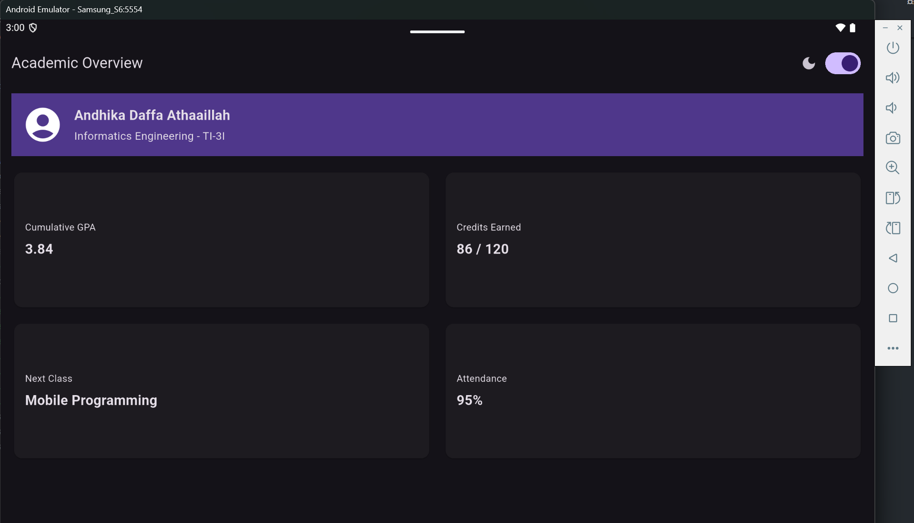

### Refactoring challenge

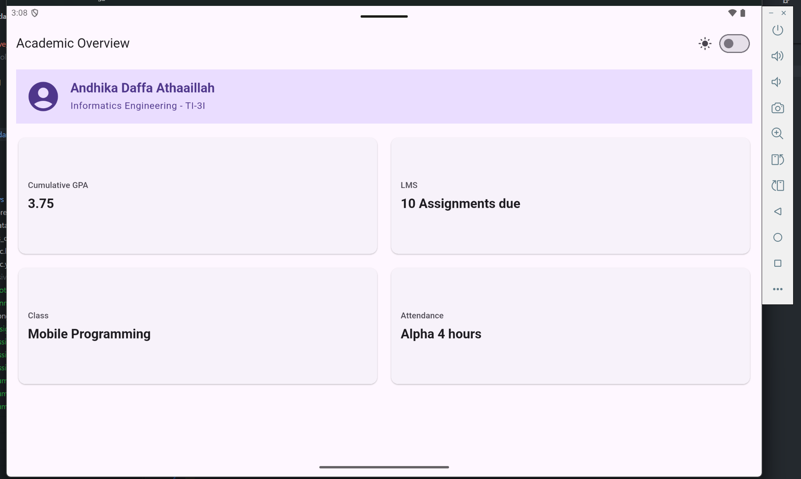

### Basic testing

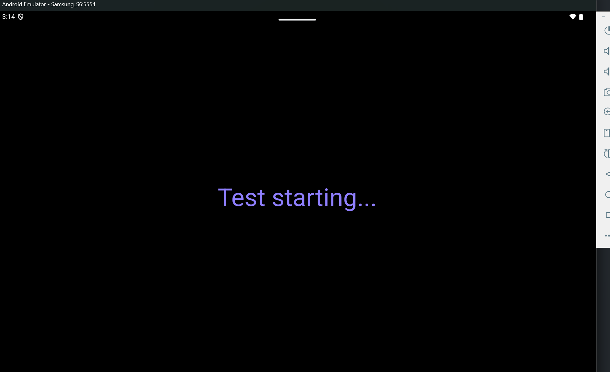

# 7. Reflection and references
## Reflection
How does imperative thinking differ from declarative thinking when building UI?
- Imperative dictates how to change the UI step-by-step (mutating widgets directly); declarative describes what the UI should look like based on the current state (rebuilding widgets when state changes). 
When does Expanded help, and when can it cause a layout error?
- It helps a widget fill the remaining available space inside a Row or Column. However, it causes layout crashes (unbounded constraints) if placed inside an infinitely scrollable parent like a ListView.
How do breakpoints and themes affect user experience?
- Breakpoints ensure the layout adapts comfortably to different screen sizes, while themes (light/dark mode) improve readability and accommodate user visual preferences.
What did you verify after receiving an AI design recommendation?
- I verified that the suggested code actually worked responsively (testing above and below the 600px breakpoint), didn't break screen-reader accessibility, and used stable Flutter widgets.

# References
Flutter UI documentation
Building responsive apps
Material Design 3
Flutter accessibility