# Flutter Week 3 - Navigation & State Management

| **Information** | **Detail** |
| --- | --- |
| Subject | Mobile Development |
| Name | Andhika Daffa Athaaillah |
| Absen | 02 |
| NIM | 244107020223 |

Build navigation and apply Riverpod-based state maagement with loading, error, and success states.

## Navigation concepts and GoRouter

## Lab 1 — Multi-page application with GoRouter

- 1. Define the router in lib/main.dart:
- 2. Home page (lib/pages/home_page.dart):
- 3. Detail page (lib/pages/detail_page.dart):
- 4. Run and observe. Open an item, then press the system back button. Notice that the path changes with the active screen the same path can also be accessed directly without going through Home. This is the advantage of a declarative router over Navigator 1.0.

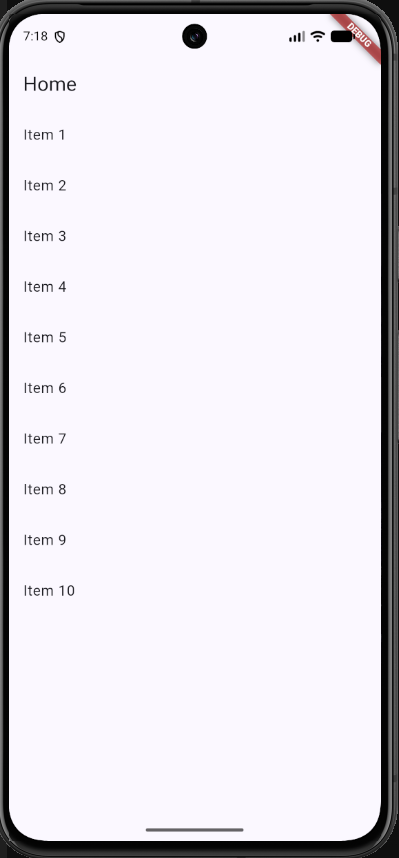 | 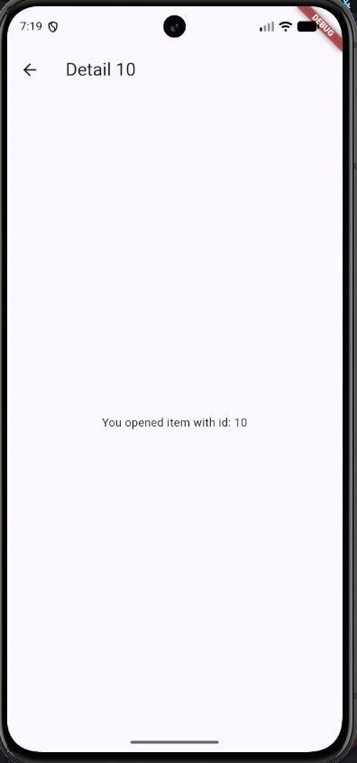

## State management with Riverpod

## Lab 2 — ToDo application with Riverpod

- 1. Wrap the application with ProviderScope in lib/main.dart:
- 2. Create the state and provider (lib/providers/todo_provider.dart):
- 3. Build the UI with ConsumerWidget (lib/pages/todo_page.dart):
- 4. Note the important patterns: ref.watch inside build automatically rebuilds the page when the list changes; ref.read(todoListProvider.notifier) inside a callback only calls a method without subscribing.

**Result:**

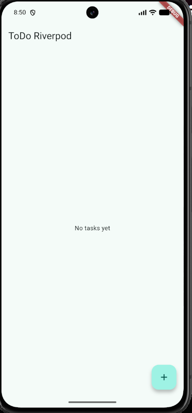 | 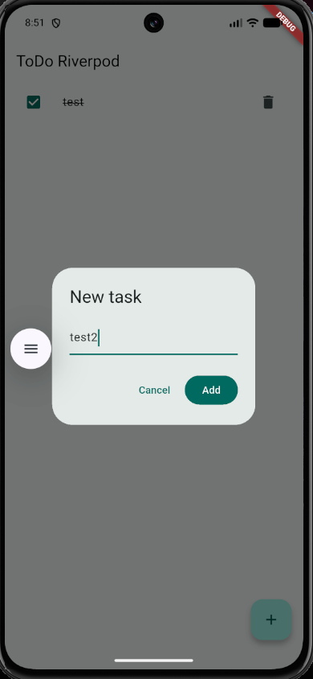

## AsyncValue: loading, error, success

## Lab 3 — Test all three states

- 1. Copy the code above into your ToDo project (or a separate project) and run it. Observe the loading screen for the first 2 seconds.

     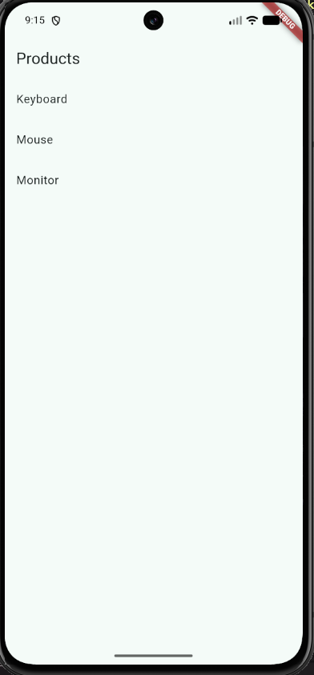 | 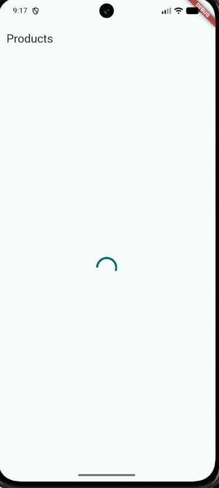

     For the first 2 seconds, the screen displays a centered loading spinner (AsyncLoading), then automatically switches to the product list (AsyncData) once the simulated delay finishes.

- 2. Temporarily change build() to throw an error: throw Exception('Failed to connect to the server');. Run and observe the error screen with its Retry button.

     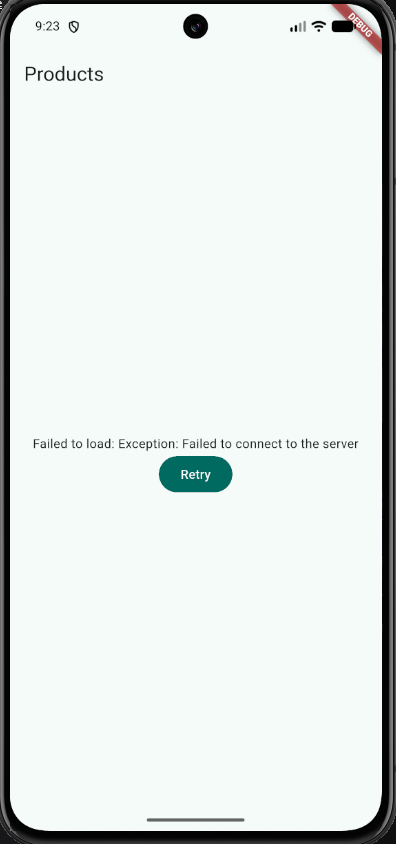

     The screen displays the error message alongside a functional Retry button, successfully capturing the AsyncError state.

- 3. Press Retry ref.invalidate re-runs the provider. Restore the code and confirm the success state is shown.

     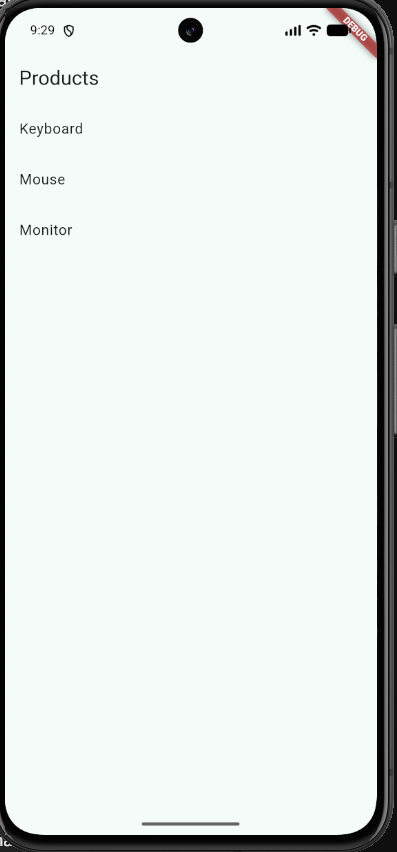

     After the code was restored and the provider re-executed via Retry, the application successfully resolved to the AsyncData state, rendering the complete list of products (Keyboard, Mouse, Monitor).

- 4. Reflect: why is showing stale data with a refresh indicator sometimes better than blanking the screen? When is that pattern important?
     `Showing slightly stale data with a subtle refresh indicator is often better than blanking the screen, because it prevents jarring layout shifts and keeps users engaged while fresh data loads in the background. It also avoids leaving them stranded on an empty screen if a request fails. This pattern is especially useful in pull-to-refresh feeds, live dashboards, and mobile apps on slow or unreliable networks.`

## AI Challenge

## AI Prompt Challenge

Ask an AI coding assistant (Cursor, Copilot, Claude Code, or equivalent) with the following prompt:

Create a Flutter page named StatsPage using flutter_riverpod.
**Requirements:**

- A ConsumerWidget with one AsyncNotifierProvider that simulates
  fetching statistics (2-second delay, ~30% chance of failure).
- The UI must handle loading (spinner), error (message + retry button),
  and success (ListView with 3 items).
- Provide a unit test for the notifier.
  Explain each part of the code with comments.

**Result:**

| 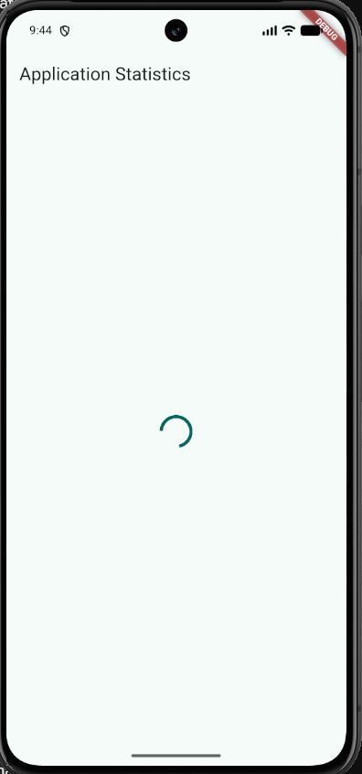 | 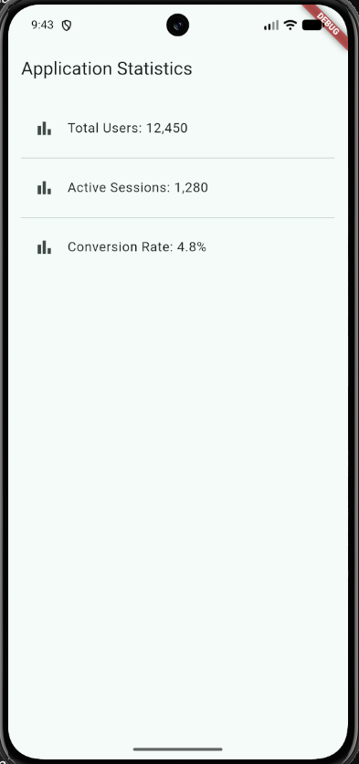 |
| :----------------------------------------------: | :----------------------------------------------: |
|            **Image 1: Loading State**            |            **Image 2: Success State**            |

- Loading State (Image 1): During the initial 2-second simulated delay, StatsNotifier is in an AsyncLoading state, displaying a centered CircularProgressIndicator.
- Success State (Image 2): Once the asynchronous task completes without errors, Riverpod transitions to AsyncData, rendering the ListView with the three requested statistics items.

# AI Verification Checklist

- [x] Is state mutated immutably (no state.add() or direct list mutation)?
      `The state is handled immutably. It returns a new list instance (const [...]) without any direct list mutation methods like .add() or .remove()`
- [x] Is ref.watch used only inside build, and ref.read inside callbacks?
      `ref.watch(statsProvider) is invoked strictly within the build method of StatsPage. The retry callback uses ref.invalidate(statsProvider) to re-trigger execution rather than misplacing ref.watch.`
- [x] Are all three AsyncValue states really handled (not only success)?
      `All three states (loading, error, and data/success) are explicitly implemented using statsAsync.when(...).`
- [x] Is the provider declared with an explicit type and not duplicated with other providers?
      `The provider is clearly declared with full explicit generic types: AsyncNotifierProvider<StatsNotifier, List<String>> and avoids duplication.`
- [x] Does the AI code use old Riverpod APIs (StateProvider antipattern, deprecated StateNotifierProvider, or unnecessary nested Consumer)? Fix them to use the Notifier/ConsumerWidget pattern.
      `Uses the modern AsyncNotifier and ConsumerWidget API. No deprecated StateNotifierProvider, StateProvider, or redundant nested Consumer widgets are used.`
- [x] Run flutter analyze and flutter test does the AI output pass without warnings?

 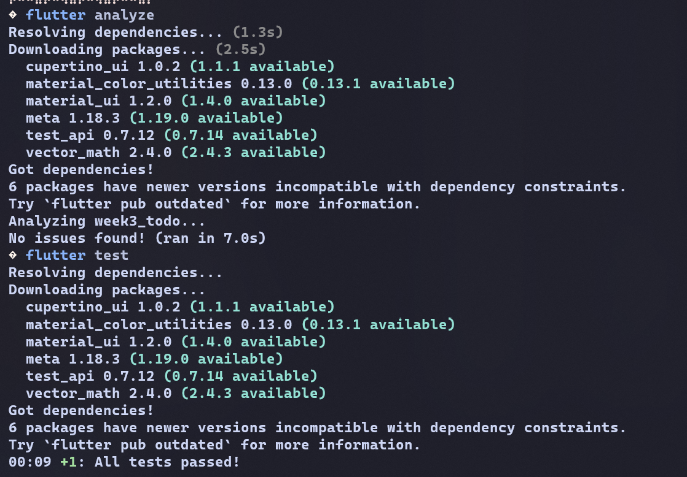 

`The code passes flutter analyze with no issues/warnings and successfully passes the StatsNotifier unit test suite via flutter test.`

## Refactoring and testing

## Refactoring Challenge

Perform the following refactoring in your ToDo app, then commit with clear messages:

- Split the ToDo row widget into a separate `TodoTile` so the `build` method becomes shorter and easier to test.
  `The inline `ListTile` was extracted into a dedicated widget at `lib/widgets/todo_tile.dart`. This keeps row presentation logic isolated, simplifies `TodoPage.build`, and makes the component easier to test independently.`
- Extract the filtering logic (for example, showing only unfinished tasks) into a derived provider that reads from `todoListProvider`.
  `The task filtering logic was moved into `uncompletedTodoListProvider`, a computed `Provider<List<Todo>>` that watches `todoListProvider` and returns only items where `!todo.done`. This keeps filtering concerns out of the UI layer.`
- Integrate the ToDo app with GoRouter: use `/` for the list and `/stats` for the statistics page, and add a `NavigationBar` to switch between them.
  `GoRouter was integrated using `StatefulShellRoute.indexedStack` to handle bottom navigation between `/` (`TodoPage`) and `/stats` (`StatsPage`), preserving each tab's state while navigating.`

## Testing

Run all verifications:

- flutter analyze
  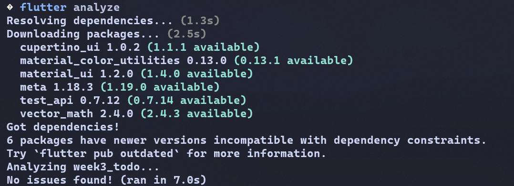
- flutter test
  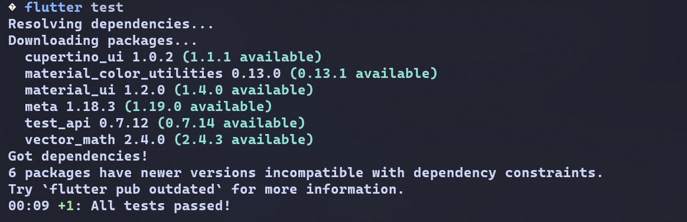

# Self-verification checklist

- [x] GoRouter navigation works: navigating pages, going back, and accessing the detail path directly.
      `Implemented tab routing via `StatefulShellRoute.indexedStack`with`/` (`TodoPage`) and `/stats` (`StatsPage`). Deep paths navigate directly and tab history is preserved without resetting.`
- [x] ProviderScope wraps the application root; ToDo state survives when switching pages.
      ``ProviderScope` is placed at the root inside `main()` wrapping `MyApp`. State managed by `todoListProvider` persists in memory and remains intact when switching back and forth between the ToDos and Stats tabs.`
- [x] The AsyncValue UI handles loading, error, and success, not only success.
      ``StatsPage` evaluates `statsAsync.when(...)` covering all three operational states: `CircularProgressIndicator` during `AsyncLoading`, error text with a retry button on simulated ~30% failure via `ref.invalidate()`, and a 3-item `ListView` on `AsyncData`.`
- [x] flutter analyze has no issues and all tests pass.
      `Both terminal checks executed cleanly with zero static analysis warnings and all unit/widget test suites passing without failures.`
- [x] AI output is verified and documented in the docs/ folder.
      `The AI prompt, generated code verification, linter adjustments, and smoke test fixes are properly documented in the project documentation.`

## Reflection

- When is setState still enough, and when should state be lifted into Riverpod?
  `setState is enough for small, temporary UI state that belongs to one widget, such as a toggle, a form field, or an animation controller. State should move to Riverpod when it must survive route changes, be shared across multiple screens or tabs, be tested independently from the widget tree, or represent asynchronous data.`
- What is the difference between context.go and context.push, and when should each be used?
  `context.go updates the app's route stack declaratively to match a target path, making it suitable for main navigation, tab switching, and deep links where the route structure should stay consistent. context.push adds a new screen on top of the current stack, which is better for sequential flows such as detail pages or temporary screens that need a back button.`
- How does AsyncValue prevent bugs compared with three separate booleans?
  `Using separate booleans such as isLoading, hasError, and hasData can produce conflicting states, like a screen being both loading and erroring at the same time. AsyncValue encodes the state as a single mutually exclusive value (AsyncLoading, AsyncError, or AsyncData), and .when() forces a complete and consistent UI response for every state.`
- Which part of the AI output did you fix, and why?
  - `Static Analysis / Linter (flutter analyze): I removed unused imports and replaced redundant double-underscore parameters with single underscores to satisfy Flutter's strict lint rules.`
  - `Widget Smoke Test Synchronization: I wrapped the widget test in ProviderScope to avoid the “No ProviderScope found” error and fixed timing issues by resetting the text controller before closing the dialog and handling async callbacks more cleanly.`
