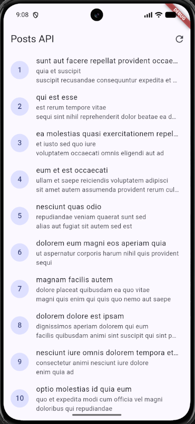
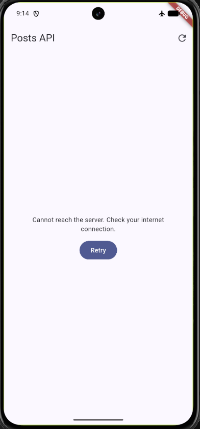
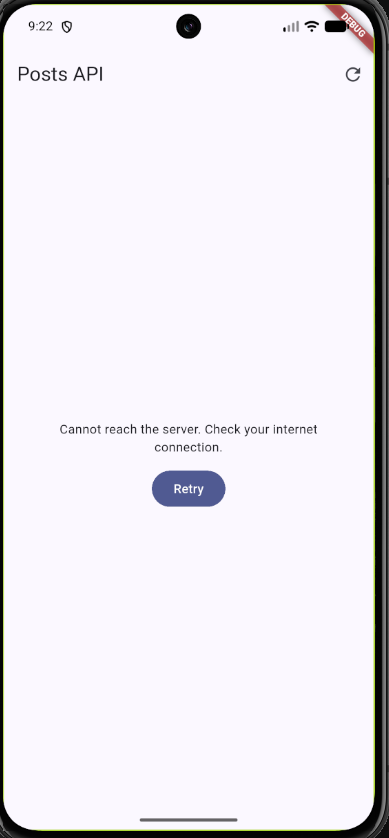
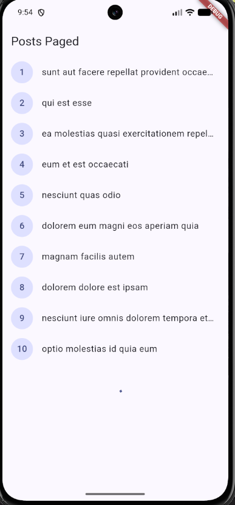
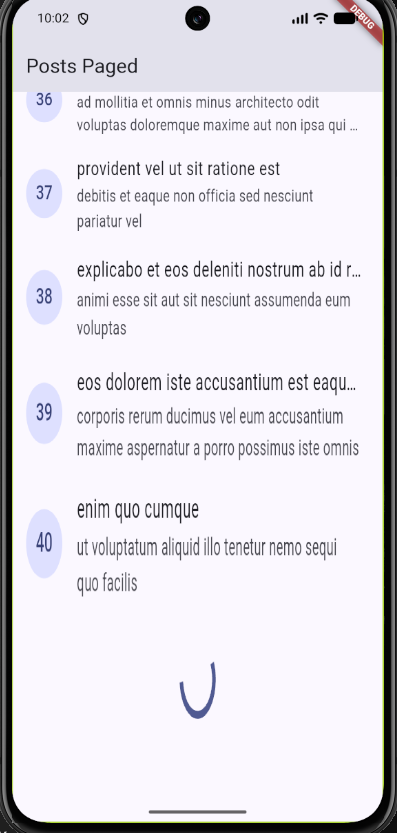
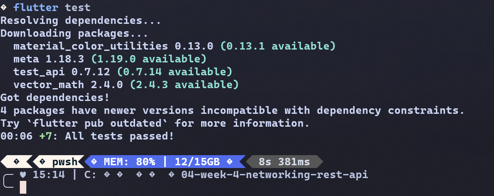
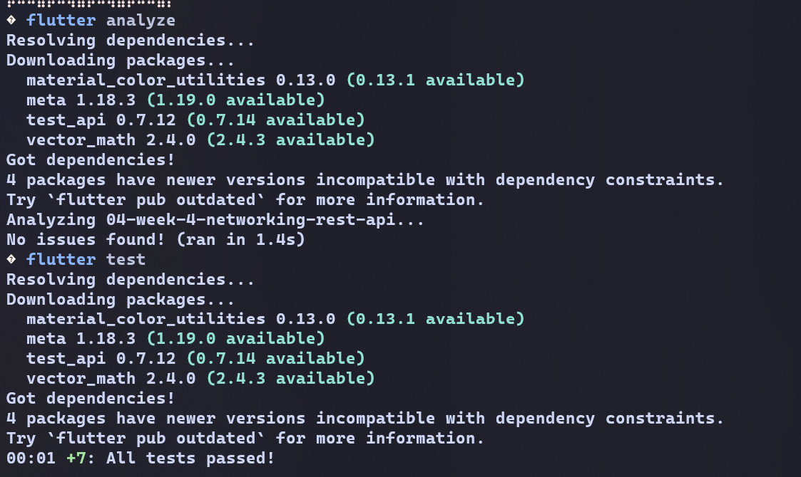

# Flutter Week 4 - Networking & REST API

| **Information** | **Detail** |
| --- | --- |
| Subject | Mobile Development |
| Name | Andhika Daffa Athaaillah |
| Absen | 02 |
| NIM | 244107020223 |

Integrate HTTP, Dio, JSON, data models, repositories, and API error handling.

---

## 1. Lab 1: Dio & Data Models

### Result Output

---

## 2. Lab 2: Provider & Error Handling

### Scenario 1: Normal Internet Connectivity

The screen begins in a loading state and shows a centered `CircularProgressIndicator`. Once the asynchronous request completes successfully, the UI moves to the success state and displays all 100 posts in a `ListView.builder`. Each item shows its ID in a `CircleAvatar`, along with shortened titles and descriptions.

### Scenario 2: Airplane Mode & Retry Flow

Turning on Airplane Mode disconnects the device from the network. Pressing the refresh action triggers a Dio `connectionError`, which is caught and converted into the user-friendly message _"Cannot reach the server. Check your internet connection."_ together with a working Retry button. Once the connection is restored and Retry is tapped, the provider is invalidated and the post list re-renders successfully.

### Scenario 3: Unreachable Host / Invalid Base URL

When `baseUrl` points to an unreachable or invalid host, Dio triggers a DNS lookup or connection failure. The app catches this `connectionError` and safely displays the fallback message (_"Cannot reach the server. Check your internet connection."_) without crashing or disrupting the UI flow. Once `baseUrl` is restored, the posts reload normally.

---

## 3. Lab 3: Basic Pagination

### 1. Initial Page Load

On initial launch, the notifier executes `Future.microtask(loadFirstPage)` and retrieves only the first page with a limit of 10 items via query parameters `_page=1&_limit=10`. The UI immediately renders items with IDs 1 to 10 inside the `ListView.builder` instead of fetching the entire 100-post dataset at once.

### 2. Infinite Scrolling & Data Growth

As the scroll position reaches within 200 pixels of `maxScrollExtent`, the `ScrollController` listener triggers `loadNextPage()`. The guard clause `if (state.isLoadingMore || !state.hasMore) return;` prevents redundant concurrent requests. The repository fetches the next page, and the notifier merges the new records with the existing list (`[...currentItems, ...items]`), expanding the list smoothly without re-rendering or reloading previous items.

### 3. End-of-Data Indicator

When the endpoint returns fewer items than the requested limit (`items.length == 10` evaluates to `false`), `hasMore` is set to `false`. The bottom list item detects `!state.hasMore` and displays the completion message _"All data loaded."_, ensuring no further network requests are dispatched.

---

## 4. AI Challenge

### Prompt Executed

Create a Flutter repository layer for the GET /comments?postId={id}
endpoint of JSONPlaceholder using Dio + flutter_riverpod.
Requirements:

- Comment model with null-safe fromJson (postId, id, name, email, body).
- CommentRepository with fetchComments(postId) + 10-second timeout.
- AsyncNotifierProvider with automatic error handling (AsyncError)
  and a user-friendly error-message function for timeout,
  connection error, 404, and 500.
- One unit test for fromJson with missing fields.
  Explain each part of the code with comments.

### AI Verification Checklist & Remediation Findings

Based on the codelab's AI verification checklist, an independent evaluation and remediation were conducted:

- **Layer Separation:** The UI does not access Dio directly. All network requests are strictly isolated inside `CommentRepository`, which is injected via Riverpod's `commentRepositoryProvider`.
- **Null-Safety & Defensive Parsing:** The `Comment.fromJson` model avoids direct non-nullable casts (`as int`) and instead implements safe default fallbacks (`?? 0` and `?? ''`), preventing runtime crashes when dealing with null values or missing fields.
- **Centralized Error Handling:** The `friendlyCommentError` function properly maps all required `DioExceptionType` scenarios (`timeout`, `connectionError`, and `badResponse` with status codes 404 and $\ge 500$) into user-friendly error messages.
- **Riverpod Notifier Refactoring:** The AI-generated notifier class structure was refactored from invalid generic bounds into a standard `AsyncNotifier<List<Comment>>` utilizing `AsyncValue.guard()` for reliable asynchronous state management.
- **Edge-Case Unit Testing:** Unit tests in `test/comment_model_test.dart` were expanded beyond the happy path to verify resilience against missing JSON fields as well as explicit `null` attributes.

### Verification Evidence (Test & Analyze)

Static code analysis and unit test suite execution completed successfully without warnings or failures:

## 5. Refactoring & Testing

### Refactoring Challenge

- **Widget Extraction (`lib/widgets/post_tile.dart`):** Extracted post rows into an isolated, reusable `PostTile` widget to keep list builders compact and independently testable.
- **Modular Error Handling (`lib/data/network_errors.dart`):** Decoupled `friendlyErrorMessage` into a standalone module re-exported by `lib/data/providers.dart`.
- **State Access Helpers (`lib/data/providers.dart`):** Added synchronous reading utilities (`readPostsOnce` and `readPostsErrorOnce`) for robust unit testing.

### Unit Tests with Fake Repository

Implemented `test/post_test.dart` using a test double (`FakePostRepository`) to verify logic without making real HTTP network calls:

1. **Model Robustness:** Confirms `Post.fromJson` handles incomplete JSON objects without exceptions.
2. **Error Translation:** Asserts `friendlyErrorMessage` correctly describes connection errors.
3. **Provider Data Delivery:** Validates that the provider delivers expected mock datasets through Riverpod.
4. **Provider Error Propagation:** Verifies that repository exceptions are correctly captured and handled by the provider container.

### Verification Evidence (Test & Analyze)

The refactored code and test suites ran successfully with zero warnings and all tests passing:

## 6. Self-Verification Checklist

Evaluation against the final codelab requirements:

- [x] **No Direct Dio Calls:** All data fetching routes strictly through repository classes and Riverpod providers.
- [x] **Four States Handled:** Loading, Error (+ Retry), Empty, and Success states are fully supported.
- [x] **Safe Pagination:** Data appends smoothly on scroll, prevents duplicate triggers, and features a terminal end-of-data indicator.
- [x] **Clean Analysis & Tests:** `flutter analyze` reports zero issues and all automated tests pass.
- [x] **Documented AI Output:** AI outputs, findings, and remediations are verified and documented in `README.md` and the `docs/` directory.

## 7. Reflection

- **Why is the UI forbidden from calling Dio directly? What breaks if this rule is violated?**
  This violates the principle of _Separation of Concerns_. If the UI directly calls Dio, widgets become tightly coupled with low-level HTTP logic. Testing also becomes harder because network calls must be mocked inside UI tests, and error and parsing logic can be duplicated across multiple screens.

- **When is client-side pagination enough, and when must you rely on server pagination (`_page` / `_limit`)?**
  Client-side pagination is enough when the dataset is small, relatively static, and can be loaded into memory without issue, such as a few dozen records. Server-side pagination should be used when the data is large, dynamic, or contains hundreds or thousands of items, because it reduces memory usage, saves bandwidth, and keeps the app responsive during the initial load.

- **How do repository exceptions become `AsyncError` without try/catch in every widget? When is explicit try/catch still needed?**
  Riverpod (`FutureProvider` and `AsyncNotifierProvider`) automatically catches async exceptions inside provider logic and converts them into `AsyncValue.error`, similar to `AsyncValue.guard()`. This allows widgets to react declaratively with `.when(data: ..., loading: ..., error: ...)`. Explicit `try/catch` is still useful for imperative actions such as form submission, deletion, or confirmation dialogs, when the app needs immediate feedback like a `SnackBar` without rebuilding the entire screen.

- **Which part of the AI output did you fix, and why?**

  1. **Null-Safety & Defensive Parsing:** I replaced direct casts such as `as int` with safe fallback values like `?? 0` and `?? ''` in `fromJson` so the app does not crash when fields are null or missing in the JSON.
  2. **Riverpod Provider Structure:** I corrected the invalid generic structure generated by the AI and converted it to the standard `AsyncNotifier<List<Comment>>` pattern, using `AsyncValue.guard()` for safer asynchronous error handling.
  3. **Test Coverage:** I expanded the unit tests beyond the happy path to cover missing keys and explicit `null` values, ensuring the model remains robust in edge cases.
