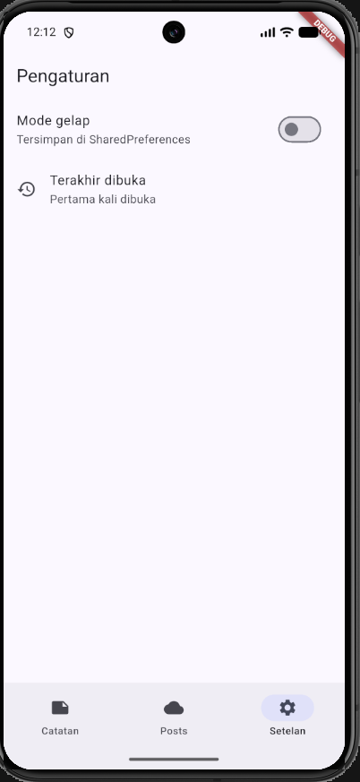
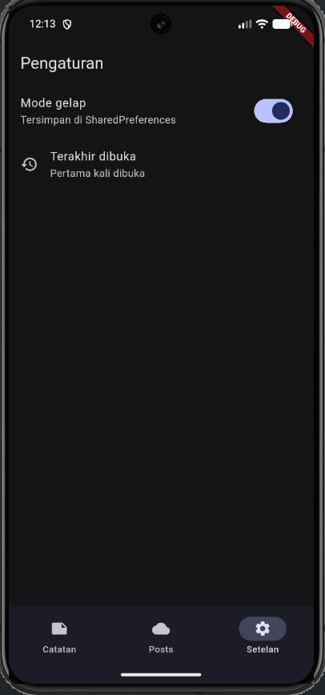
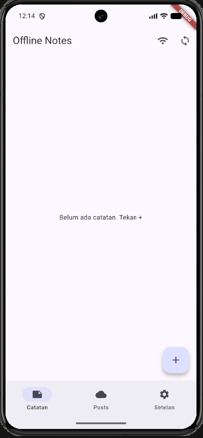
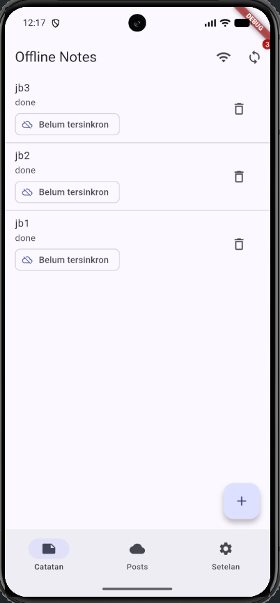
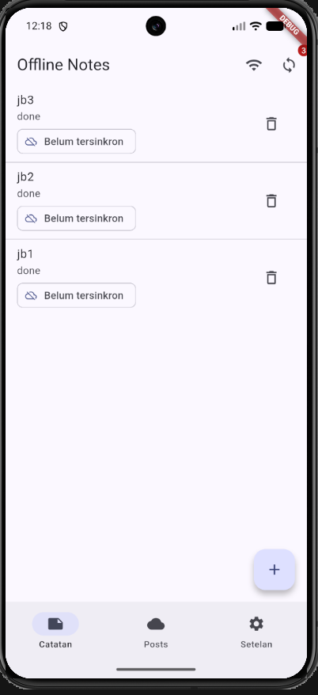
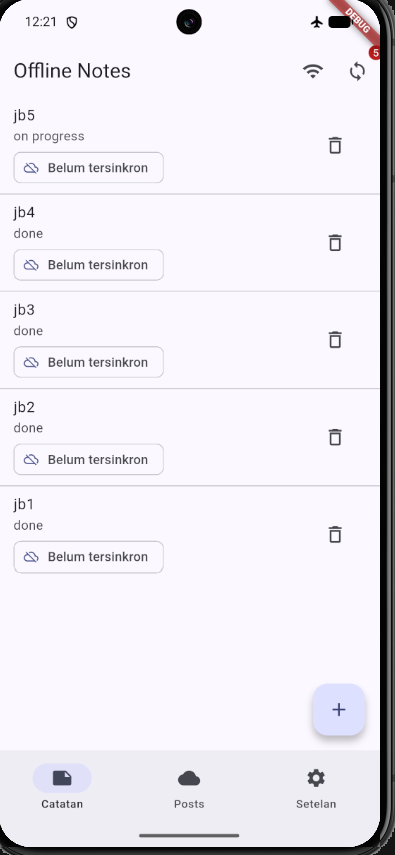
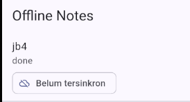
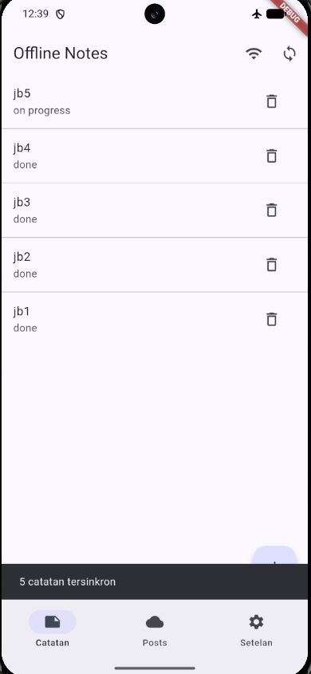
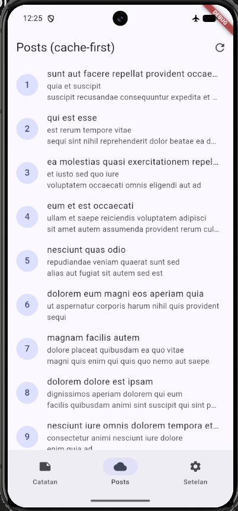
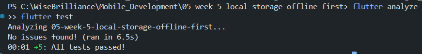

# Flutter Week 5 - Local Storage & Offline First

| **Information** | **Detail** |
| --- | --- |
| Subject | Mobile Development |
| Name | Andhika Daffa Athaaillah |
| Absen | 02 |
| NIM | 244107020223 |

Offline Notes app: SharedPreferences for settings, SQLite (sqflite) for notes, and an offline-first
flow with cache-first reads, a dirty flag, and a sync queue.

## Features

- Dark mode toggle and "last opened" time (SharedPreferences)
- Persistent notes CRUD (SQLite), sorted by newest `updated_at`
- Offline-first: cache-first posts, dirty flag + `syncNotes`, explicit conflict rule
- Note detail page with GoRouter (`/note/:id`)
- Loading, error (+ Retry), empty, and success states everywhere

## Tech Stack

Flutter, flutter_riverpod, shared_preferences, sqflite, path, dio, go_router

## How to Run

```bash
flutter create --project-name week5_offline_notes .
flutter pub add flutter_riverpod:^2.6.1 shared_preferences sqflite path dio go_router
flutter run
flutter analyze
flutter test
```

## Project Structure

```
lib/
├── main.dart
├── data/
│   ├── local/ (db.dart, note.dart)
│   ├── models/post.dart
│   ├── repositories/ (note_repository.dart, post_repository.dart)
│   ├── prefs.dart
│   ├── providers.dart
│   ├── network_errors.dart
│   └── sync.dart
├── pages/ (home, notes, note_detail, posts, settings)
└── widgets/ (note_tile.dart, note_dialog.dart)
test/note_test.dart
docs/ai-challenge.md
```

---

## 1. Lab 1: SharedPreferences (Settings)

Files: `lib/data/prefs.dart`, `darkModeProvider` in `lib/data/providers.dart`, `lib/pages/settings_page.dart`

All key-value access is centralized in `PrefsRepository`. `DarkModeNotifier` (an `AsyncNotifier<bool>`)
loads the saved value in `build()` and saves it through `AsyncValue.guard()` on `toggle()`.
`main()` reads the previous `last_opened_at` before overwriting it, so the Settings page shows the
time of the previous session.

### Result Output




---

## 2. Lab 2: SQLite Notes CRUD

Files: `lib/data/local/note.dart`, `lib/data/local/db.dart`, `lib/data/repositories/note_repository.dart`, `lib/pages/notes_page.dart`

`NoteRepository` is the only gateway to the `notes` table. Its constructor accepts an `openDb` function
so tests can inject a fake. Every create and update sets `dirty = 1` and a fresh `updated_at`.
`NotesNotifier` reloads the list after each mutation, so the UI stays in sync with the database.

### Result Output





---

## 3. Lab 3: Offline-First (Cache, Dirty Flag, Sync)

Files: `lib/data/sync.dart`, `postsProvider` and `forceOfflineProvider` in `lib/data/providers.dart`, `lib/pages/posts_page.dart`

1. **Cache-first read:** `PostsNotifier.build()` returns rows from `cached_posts` immediately, then refreshes
   from JSONPlaceholder in the background and saves the result.
2. **Dirty sync:** `syncNotes` counts dirty notes, simulates an upload with a 1-second delay, then calls
   `markAllSynced()`, so the badge returns to 0.
3. **Deterministic offline:** the `forceOffline` toggle (airplane icon) blocks sync and network refresh
   without relying on Wi-Fi.
4. **Conflict rule:** last-write-wins by `updated_at` (`resolveConflict`).

### Airplane Mode Evidence

| Step | Screenshot |
| --- | --- |
| Notes list while offline |  |
| Dirty badge before sync |  |
| Badge after sync (0) |  |
| Cached posts without internet |  |

---

## 4. AI Challenge

Full prompt, initial AI output, comparison table, and final decision are in [`docs/ai-challenge.md`](docs/ai-challenge.md).

### Final Decision

| Need | Choice | Reason |
| --- | --- | --- |
| Preferences | SharedPreferences | Small primitive values |
| Notes + post cache | SQLite (sqflite) | Collection data, ordering, dirty flag, partial updates |

### AI Verification Findings

- **Notes in SharedPreferences?** Rejected. A JSON string makes queries and partial updates fragile.
- **Schema supports sync queue?** Yes (`updated_at`, `dirty`). I added an index on `dirty`.
- **"Real-time" claim:** Only Drift and Hive have built-in streams. I use Riverpod to refresh after mutations instead.
- **Boilerplate estimate:** Drift's codegen and migrations are too heavy for two tables, so I rejected the AI's Drift recommendation.

---

## 5. Refactoring & Testing

### Refactoring Challenge

- **Widget extraction (`lib/widgets/note_tile.dart`):** `NoteTile` shows an "unsynced" chip when `dirty == true`.
- **Sync logic (`lib/data/sync.dart`):** `PostCache`, `syncNotes`, and `resolveConflict` moved out of the repository so it stays CRUD-only.
- **Detail page (GoRouter `/note/:id`):** `noteByIdProvider` reads from `NoteRepository.getById`, not from the list state.

### Unit Tests with Fake Repository (`test/note_test.dart`)

1. **Safe mapping:** `Note.fromMap` handles missing fields.
2. **Dirty flag:** survives `toMap` / `fromMap`.
3. **Provider success:** delivers data from `FakeNoteRepository`.
4. **Provider error:** the repository exception is captured as an error.
5. **Conflict rule:** `resolveConflict` picks the newest `updated_at`.

### Verification Evidence (Test & Analyze)



---

## 6. Self-Verification Checklist

- [x] **No direct DB access in UI:** pages only read providers; SQLite and SharedPreferences are accessed in repositories only.
- [x] **Airplane mode works:** read, add, and delete notes offline.
- [x] **Dirty badge accurate:** before and after sync; cached posts show without internet.
- [x] **Clean analysis & tests:** `flutter analyze` has zero issues and all tests pass.
- [x] **Documented AI output:** in `docs/ai-challenge.md`.

## 7. Reflection

- **Why must the notes list not be stored in SharedPreferences? What breaks if violated?**
  SharedPreferences is meant for small primitive values. Storing a list as one JSON string means every
  edit rewrites and re-parses the entire list, with no `WHERE` or `ORDER BY`, no partial updates, and no
  per-row dirty flag. It gets slow and fragile as the data grows, and sync becomes hard because individual
  changes cannot be tracked.

- **When is cache-first enough, and when do you need another strategy?**
  Cache-first is enough for data that changes slowly and where showing slightly stale content is acceptable
  (posts, articles, profiles). For data where freshness matters, such as real-time prices or stock levels,
  network-first is better, with the cache only as a fallback when the network fails.

- **How does the dirty flag become a sync queue without blocking the UI? When is a separate outbox table needed?**
  Local writes finish immediately with `dirty = 1`, so the UI never waits for the network. Sync runs
  asynchronously, and `markAllSynced()` clears the flag only after the server succeeds. A separate outbox
  table becomes necessary when one row needs several pending operations in order (create, then update, then
  delete), when deletes must be synced (the row is already gone locally), or when failed attempts need
  retry counts.

- **Which part of the AI recommendation did you reject, and why?**
  I rejected Drift for notes. It is strong on type-safety and streams, but the codegen and migration
  boilerplate is not justified for two tables. Riverpod already handles refreshing after mutations.
  I also added an index on the `dirty` column, which the AI schema did not include.
